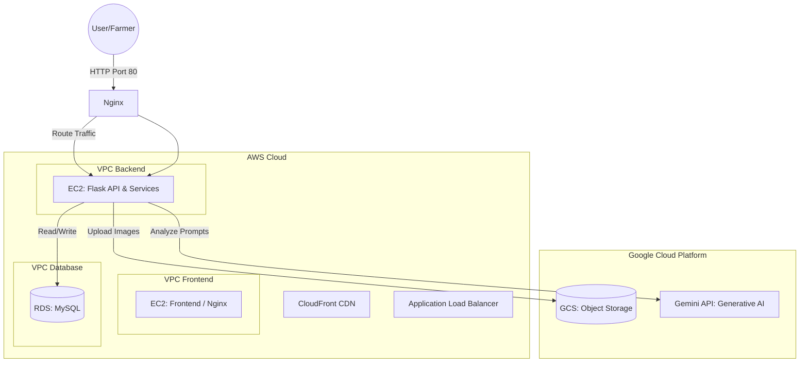

# FarmAssist AI Architecture

## Multi-Cloud Deployment Architecture (AWS + GCP)

## System Components

1. **Frontend VPC**: Berisi container **NGINX** yang mengekspos Port 80. NGINX bertindak sebagai *Reverse Proxy* (menerima traffic luar) dan juga bisa ditingkatkan fungsinya untuk langsung melayani file statis tanpa membebani Flask.
2. **Backend/API VPC**: Tempat kontainer **Flask API** berjalan. Terkoneksi ke jaringan Nginx namun *terisolasi dari internet langsung*. Melayani request UI (Jinja SSR) dan endpoint `/api`.
3. **Database VPC**: Isolated Database subnet (Private) untuk **MySQL**. Menggunakan *internal network* di Docker sehingga tidak bisa di-*ping* dari luar host.
4. **GCP Storage**: Abstraksi Object Storage digunakan untuk menyimpan gambar hasil unggahan pengguna (saat ini fallback ke lokal).
5. **AI Service**: Google Generative AI untuk prompt engineering tanpa training.
