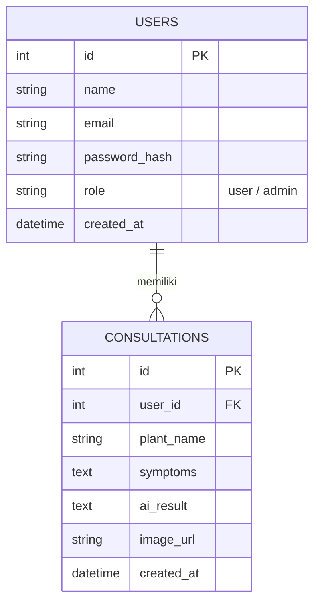

# Entity Relationship Diagram (ERD)

```mermaid
erDiagram
    USERS ||--o{ CONSULTATIONS : "memiliki"
    
    USERS {
        int id PK
        string name
        string email
        string password_hash
        string role "user / admin"
        datetime created_at
    }
    
    CONSULTATIONS {
        int id PK
        int user_id FK
        string plant_name
        text symptoms
        text ai_result
        string image_url
        datetime created_at
    }
```
